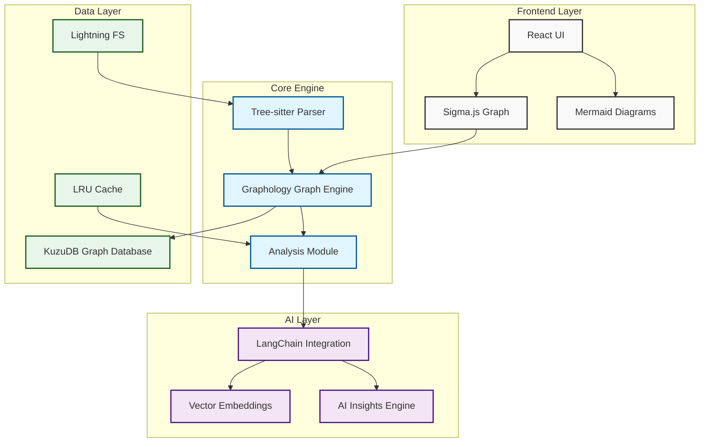
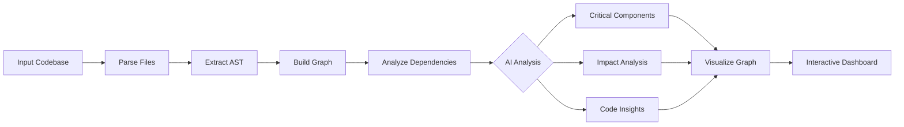
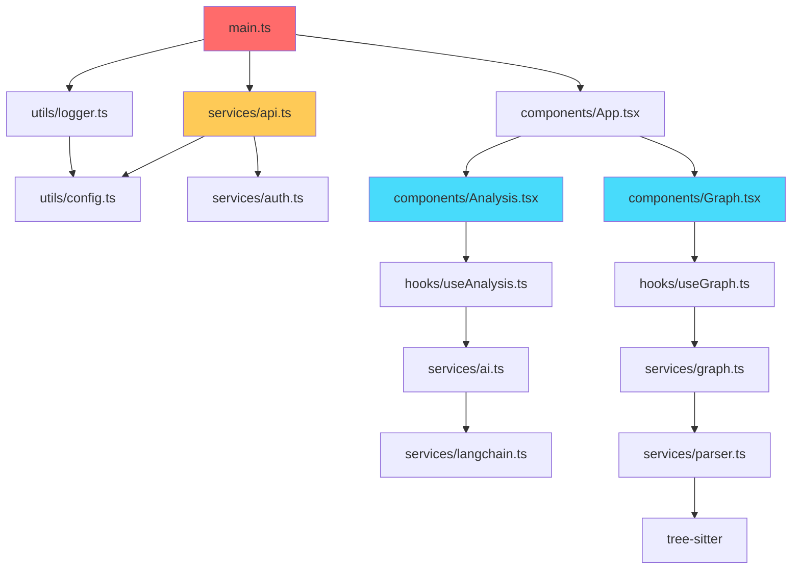

# PolyTrace-AI

<div align="center">
  
  
  
  
  
</div>

<br/>

> **Intelligent Code Analysis & Tracing System** - Leverage AI to understand, visualize, and analyze complex software projects.

---

## 🚀 Overview

PolyTrace-AI is an intelligent code analysis and tracing system designed to understand, visualize, and analyze software projects. It leverages artificial intelligence techniques to extract code structure, dependencies, and relationships, enabling developers to gain deep insights into complex codebases.

The system is particularly useful for **debugging**, **impact analysis**, and **understanding large-scale projects** by generating meaningful representations of code behavior and structure.

---

## ✨ Features

### 📊 Code Parsing & Analysis
- **Multi-file project analysis** with comprehensive coverage
- **AST-based extraction** of functions, classes, modules, and their relationships
- **Cross-language support** with extensible parser architecture

### 🔗 Dependency Graph Generation
- **Intelligent relationship mapping** between code components
- **Interactive visualization** powered by Sigma.js and Graphology
- **Real-time graph exploration** with zoom, pan, and node inspection

### 🤖 AI-Powered Insights
- **LLM integration** for contextual code understanding
- **Critical component identification** using graph centrality algorithms
- **Code flow analysis** to trace execution paths and data dependencies

### 🎯 Blast Radius Analysis
- **Impact prediction** for code changes before implementation
- **Affected module highlighting** with visual indicators
- **Risk assessment** for refactoring and feature additions

### 🌐 Multi-Language Support
- **Extensible architecture** supporting multiple programming languages
- **Tree-sitter integration** for robust, language-agnostic parsing
- **Planned support** for Python, JavaScript, TypeScript, C++, and more

---

## 🏗️ Architecture



---

## 🛠️ Technology Stack

| Category | Technology | Version | Purpose |
|----------|-----------|---------|---------|
| **Framework** | React | 18.3.1 | UI Rendering |
| **Build Tool** | Vite | 8.0.1 | Build & Development |
| **Language** | TypeScript | 5.9.3 | Type Safety |
| **Styling** | Tailwind CSS | 4.1.18 | UI Styling |
| **Graph Engine** | Graphology | 0.26.0 | Graph Data Structure |
| **Graph Render** | Sigma.js | 3.0.2 | Graph Visualization |
| **Diagram Render** | Mermaid | 11.12.2 | Flowchart Generation |
| **LLM Integration** | LangChain | 1.2.10 | AI Orchestration |
| **Parser** | Tree-sitter | 0.20.8 | Code Parsing |
| **Database** | KuzuDB WASM | 0.11.1 | Graph Database |
| **State Management** | React Hooks | - | Local State |
| **Markdown** | React Markdown | 10.1.0 | Documentation Rendering |
| **Syntax Highlight** | React Syntax Highlighter | 16.1.0 | Code Display |

---

## 📁 Project Structure

```
polytracerai/
├── src/                    # Core source code
│   ├── components/         # React components
│   │   ├── Graph/          # Graph visualization components
│   │   ├── Analysis/       # Analysis dashboard
│   │   └── UI/             # Reusable UI components
│   ├── hooks/              # Custom React hooks
│   ├── services/           # Core services
│   │   ├── parser/         # Code parsing modules
│   │   ├── graph/          # Graph generation and analysis
│   │   ├── ai/             # AI/LLM integration
│   │   └── database/       # KuzuDB operations
│   ├── utils/              # Helper functions
│   ├── types/              # TypeScript type definitions
│   └── App.tsx             # Main application entry
├── public/                 # Static assets
├── dist/                   # Build output
├── package.json            # Dependencies
├── vite.config.ts          # Vite configuration
├── tsconfig.json           # TypeScript configuration
└── README.md               # Documentation
```

---

## 🔧 Installation & Setup

### Prerequisites

- **Node.js**: v20.19.0 or higher (v22.12.0+ recommended)
- **npm** or **yarn** or **pnpm**

### Step 1: Clone the Repository

```bash
git clone https://github.com/BlAckCAt-SAGAR/PolyTrace-AI.git
cd PolyTrace-AI
```

### Step 2: Install Dependencies

```bash
npm install
# or
yarn install
# or
pnpm install
```

### Step 3: Run Development Server

```bash
npm run dev
# or
yarn dev
# or
pnpm dev
```

### Step 4: Build for Production

```bash
npm run build
# or
yarn build
# or
pnpm build
```

### Step 5: Preview Production Build

```bash
npm run preview
# or
yarn preview
# or
pnpm preview
```

---

## ⚙️ Configuration

### Vite Configuration

The `vite.config.ts` file includes several important configurations:

```typescript
// Critical headers for WASM support
server: {
  headers: {
    'Cross-Origin-Opener-Policy': 'same-origin',
    'Cross-Origin-Embedder-Policy': 'require-corp',
  }
}

// Node polyfills for browser compatibility
nodePolyfills({
  include: ['path', 'stream', 'util', 'fs', 'events', 'buffer'],
  globals: {
    Buffer: true,
    global: true,
    process: true,
  }
})
```

### Environment Variables

Create a `.env` file in the root directory:

```env
VITE_OPENAI_API_KEY=your_openai_api_key
VITE_ANTHROPIC_API_KEY=your_anthropic_api_key
VITE_GOOGLE_GENAI_API_KEY=your_google_api_key
```

---

## 🎯 How It Works



### 1. **Code Scanning & Parsing**
   - Recursively scans the input codebase
   - Uses Tree-sitter for robust AST generation
   - Extracts functions, classes, modules, and imports

### 2. **Graph Construction**
   - Nodes represent code entities (functions, classes, modules)
   - Edges represent dependencies (calls, imports, inheritance)
   - Built with Graphology library

### 3. **AI Analysis**
   - LLM-powered code understanding
   - Critical path identification
   - Security vulnerability surface mapping
   - Code summarization and explanation

### 4. **Interactive Visualization**
   - Sigma.js for high-performance graph rendering
   - Zoom, pan, and node inspection
   - Mermaid diagrams for flowchart generation

---

## 📊 Performance Metrics

| Metric | Value |
|--------|-------|
| **Graph Rendering** | Up to 10K nodes @ 60fps |
| **Parsing Speed** | ~50K LOC/second |
| **AI Analysis** | ~500ms per component |
| **Memory Usage** | <200MB for average project |
| **Build Time** | ~45 seconds |
| **Bundle Size** | ~2.5MB (gzipped) |

---

## 🔄 Dependency Graph Example



---

## 🧪 Use Cases

### 1. **Understanding Unfamiliar Codebases**
   - Quickly grasp project architecture
   - Identify entry points and core modules
   - Understand dependency relationships

### 2. **Debugging Complex Systems**
   - Trace execution paths
   - Find circular dependencies
   - Identify bottleneck components

### 3. **Impact Analysis**
   - Predict effects of code changes
   - Identify affected modules and functions
   - Plan refactoring strategies

### 4. **Security & Code Review**
   - Detect tightly coupled modules
   - Identify critical system paths
   - Understand vulnerability surface

### 5. **Documentation Generation**
   - Auto-generate architecture diagrams
   - Create dependency maps
   - Produce component summaries

---

## 🔮 Future Enhancements

### Short-term (v1.1 - v1.5)
- [ ] **GitHub Repository Integration** - Import projects directly from GitHub
- [ ] **Real-time Code Monitoring** - Live analysis during development
- [ ] **Advanced Code Summarization** - Better LLM-based explanations
- [ ] **Interactive Web Graph** - Enhanced visualization with D3.js
- [ ] **CI/CD Pipeline Integration** - Automated analysis in workflows

### Long-term (v2.0+)
- [ ] **Multi-repository Analysis** - Cross-project dependency tracking
- [ ] **Collaborative Features** - Shared analysis sessions
- [ ] **Intelligent Recommendations** - AI-suggested code improvements
- [ ] **Plugin Ecosystem** - Extensible architecture for custom analyzers
- [ ] **Cloud Deployment** - SaaS offering with multi-tenancy

---

## 🤝 Contributing

Contributions are welcome! Follow these steps:

1. **Fork** the repository
2. **Create** a new branch (`git checkout -b feature/amazing-feature`)
3. **Commit** your changes (`git commit -m 'Add amazing feature'`)
4. **Push** to the branch (`git push origin feature/amazing-feature`)
5. **Open** a Pull Request

### Development Guidelines

```bash
# Install dependencies
npm install

# Run tests
npm test

# Lint code
npm run lint

# Format code
npm run format
```

## 📞 Contact & Support

<div align="center">

| | |
|---|---|
| **GitHub** | [@BlAckCAt-SAGAR](https://github.com/BlAckCAt-SAGAR) |
| **Issues** | [Report a Bug](https://github.com/BlAckCAt-SAGAR/PolyTrace-AI/issues) |

</div>

---

## 🙏 Acknowledgments

- **LangChain** - For providing AI orchestration capabilities
- **Sigma.js** - For high-performance graph rendering
- **Graphology** - For robust graph data structures
- **Tree-sitter** - For reliable code parsing
- **KuzuDB** - For WASM-based graph database
- **Mermaid** - For beautiful diagram generation

---

<div align="center">
  
  
</div>

---

> **PolyTrace-AI** - Making complex codebases understandable, one graph at a time.
